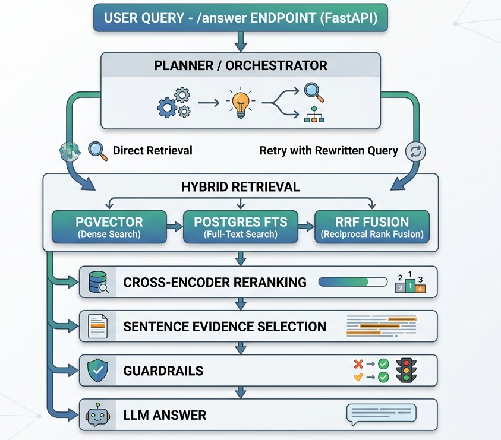

RAG (Retrieval-Augmented Generation) pipeline using FastAPI and Ollama.

Document ingestion
       ↓
OCR + parsing
       ↓
Chunking pipeline
       ↓
Embedding pipeline
       ↓
Vector storage
       ↓
Retrieval API
       ↓
LLM reasoning
       ↓
Evaluation pipeline

1. Ingestion Endpoint (/ingestion) 
Smart Chunking: Splits text by line breaks and paragraphs.
Context Retention: Ensures a minimum of 800 characters per chunk with sentence overlap.
Embeddings: Uses all-MiniLM-L6-v2 via Sentence-Transformers.
Storage: Persists Document ID, chunk text, and vector embeddings in PostgreSQL. 
2. Query Orchestration (/answer)
Planner: Determines if a query needs direct retrieval or a retry with a rewritten query for better intent matching.
Hybrid Retrieval: Combines results from:
pgvector (Semantic search)
Postgres Full-Text Search (Lexical search)
RRF (Reciprocal Rank Fusion) to merge and score both sources. 
3. Precision Ranking & Filtering
Cross-Encoder Re-ranking: Re-scores top-K chunks using an LLM to identify the most relevant lexical sections.
Sentence Evidence Selection: Extracts specific sentences from chunks based on cosine similarity and text normalisation. This reduces LLM token usage by sending only "evidence" rather than entire chunks.
Guardrails:
Empty query validation.
Similarity score thresholding.
Sentence length limits. 
4. Generation
LLM Integration: Invokes local models via the Ollama client.
Prompt Engineering: Structured system prompts to ensure grounded, evidence-based answers. 
🛠️ Tech Stack
Framework: FastAPI
Database: PostgreSQL (pgvector + FTS)
Embeddings: all-MiniLM-L6-v2
LLM Runtime: Ollama